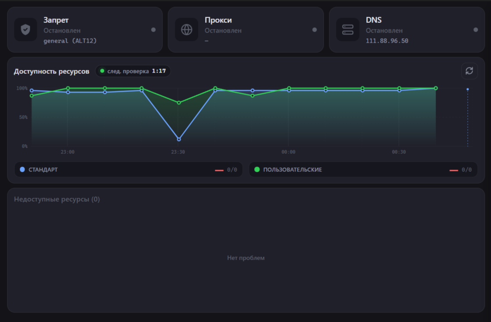

  
  
  

  # ZPUI
  ### Простой и мощный обход блокировок для Windows
  
  **Discord • YouTube • Twitch • и многие другие сервисы работают без ограничений**
  
  
  
  
  
  

---

## 💡 Почему именно ZPUI?

Многие инструменты для обхода блокировок требуют работы с командной строкой, правки конфигурационных файлов и глубоких знаний сети. **ZPUI создан для того, чтобы это было не нужно.**

- 🚀 **Работает из коробки**: Скачал → Установил → Нажал одну кнопку.
- 🧠 **Умный автоподбор**: Программа самостоятельно тестирует соединение и выбирает идеальную стратегию именно для вашего интернет-провайдера.
- 🔒 **Честно и прозрачно**: Полностью открытый исходный код. Никаких скрытых майнеров, рекламы или сбора личных данных.

---

## 🚀 Быстрый старт (3 простых шага)

1. **Скачайте программу**  
   Выберите удобный вариант на странице [релизов](https://github.com/suzcuaru/ZPUI/releases/latest):
   - 📥 **[Установщик (.exe)](https://github.com/suzcuaru/ZPUI/releases/latest)** — рекомендуется для большинства пользователей.
   - 📦 **[Портативная версия (.zip)](https://github.com/suzcuaru/ZPUI/releases/latest)** — не требует установки, можно запускать с флешки.

2. **Запустите от имени администратора**  
   При первом запуске Windows запросит права администратора. Это **обязательное требование** для работы сетевого драйвера, который обеспечивает обход блокировок.

3. **Нажмите "Подключиться"**  
   Встроенный мастер настройки автоматически подберёт оптимальные параметры. Вам останется только дождаться зелёного индикатора успеха.

---

## ⚠️ Важно про антивирусы (Windows Defender / SmartScreen)

> При первом запуске Windows может показать предупреждение *"Неизвестное приложение"* или антивирус может заблокировать файл `WinDivert.dll`.  
> **Это стандартное ложное срабатывание.** Программа использует легальный драйвер с открытым кодом для перехвата сетевых пакетов (точно так же работают все подобные инструменты).  
> **Решение:** Нажмите *"Подробнее"* → *"Выполнить в любом случае"* или просто добавьте папку с ZPUI в исключения вашего антивируса.

---

## 🔥 Основные возможности

| Возможность | Как это помогает вам |
|:---:|---|
| 🛡️ **Ядро Zapret** | Стабильный доступ к заблокированным ресурсам без заметного падения скорости или роста пинга. |
| 🧠 **Автовыбор стратегии** | Забудьте о ручном подборе параметров. Программа сделает всё сама за пару секунд. |
| 📱 **SOCKS5 Прокси** | Легко раздайте обход блокировок на телефон, планшет или Smart TV по вашей домашней Wi-Fi сети. |
| 🎮 **DNS для консолей** | Специальные настройки для стабильной работы Xbox, PlayStation и других игровых платформ. |
| 📊 **Живой мониторинг** | Наглядные графики скорости и список подключенных к прокси устройств прямо на главном экране. |
| 🔄 **Автообновление** | Программа сама сообщит о выходе новой версии и обновится в один клик. |
| 🛠️ **Встроенная диагностика** | Возникла проблема? Запустите диагностику, и программа сама подскажет, как её решить. |

---

## 📸 Как это выглядит

Главный экран (Дашборд) интуитивно понятен: вся статистика и управление сосредоточены в одном месте.

  

---

## 💻 Системные требования

- **Операционная система:** Windows 10 или Windows 11 (поддержка 32-бит и 64-бит)
- **Права доступа:** Права администратора (только на момент установки/запуска драйвера)
- **Интернет:** Любое стабильное подключение

---

## ❓ Частые вопросы (FAQ)

**Q: Это действительно бесплатно?**  
A: Да, ZPUI полностью бесплатен и распространяется с открытым исходным кодом.

**Q: Сайт всё равно не открывается, что делать?**  
A: Нажмите кнопку *"Диагностика"* в главном меню. Если это не помогло, зайдите в настройки и отключите "Автовыбор стратегии", чтобы попробовать другие варианты вручную.

**Q: Как раздать обход на телефон?**  
A: Включите опцию *"SOCKS5 Прокси"* в настройках ZPUI. Программа покажет ваш локальный IP-адрес и порт. Введите эти данные в настройках прокси на телефоне (убедитесь, что телефон и ПК подключены к одной Wi-Fi сети).

**Q: Это замедлит мой интернет или повысит пинг в играх?**  
A: Ядро оптимизировано для минимального вмешательства в трафик. Влияние на скорость и пинг практически незаметно при правильно подобранной стратегии.

---

## 🤝 Благодарности

ZPUI стоит на плечах гигантов. Огромная благодарность авторам этих проектов:

- **[bol-van/zapret](https://github.com/bol-van/zapret)** — за мощное и надёжное ядро для обхода DPI.
- **[Flowseal/zapret-discord-youtube](https://github.com/Flowseal/zapret-discord-youtube)** — за актуальные и протестированные стратегии (профили).
- **[Wails](https://wails.io/)** — за великолепный фреймворк, позволивший создать красивое и быстрое приложение на Go + Web.

---

## 📜 Лицензия

Проект распространяется под лицензией **MIT License**. Это означает, что вы можете свободно использовать, изучать и модифицировать код. Подробности в файле [LICENSE](LICENSE).

---

  **⭐ Программа помогает вам? Поставьте звезду репозиторию!**  
  Это лучшая поддержка для разработчика и сигнал, что проект нужен людям.

  [🐞 Сообщить о баге](https://github.com/suzcuaru/ZPUI/issues) · [💡 Предложить идею](https://github.com/suzcuaru/ZPUI/issues) · [📥 Скачать последнюю версию](https://github.com/suzcuaru/ZPUI/releases/latest)

